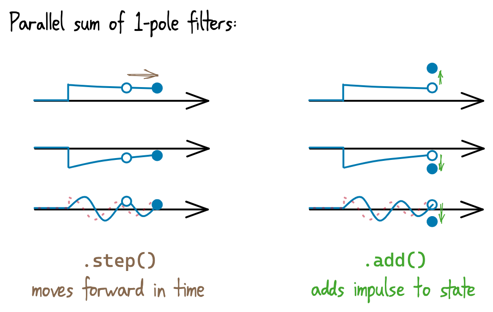
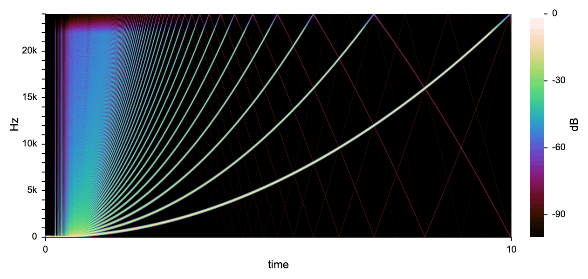

# Elliptic BLEP

This provides BLEP antialiasing, for producing a sampled signal from a continuous-time polynomial-segment signal, based on an 11th-order continuous-time 20kHz elliptic lowpass.  It uses pre-designed coefficients for simplicity.

The filter is expressed as the sum of 1-pole filters, since they're easy to deal with in continous time.  It can be redesigned using the Python/SciPy code in `design/`, which outputs coefficients as C++ code.

## How to use

This is a header-only C++ template:

```cpp
#include "elliptic-blep.h"

signalsmith::blep::EllipticBlep<float> blep;
```

### Methods

* `.get()`: sums the 1-pole states together to get the filter output at the current point in time.
* `.step(samples=1)`: moves the filter state forward in time, by some (fractional) number of samples
* `.add(amount, blepOrder, samplesInPast)`: adds in some event for which the aliasing should be canceled.
* `.reset()`

The `blepOrder` argument of `.add()` specifies which type of discontinuity (where `0` is an impulse, `1` is a step discontinuity, `2` an instantaneous gradient change etc.), and `amount` specifies how much the corresponding differential changed by.  



### Initialising: BLEP vs "direct" mode

The default mode is the classic BLEP pattern: you synthesise a waveform which will contain aliasing, and then add in an aliasing-cancellation signal.  In this mode, the sample-rate argument is optional, and is only needed if you want to have the exact same phase response (or cutoff) at different rates.

If `direct` is enabled during initialisation, you don't have to synthesise the waveform yourself - it will be included in the filter's output.  However, this only works for purely polynomial-segment signals, and you *have* to inform the class of every discontinuity (including at the start of synthesis).  The sample-rate is not optional for this mode, because the output will be highpassed at 20Hz and that needs to be correctly placed.

## Example: sawtooth oscillator

```cpp
struct SawtoothOscillator {
	float freq = 0.001f; // relative to sample-rate
	float amp = 1;
	
	void reset() {
		blep.reset();
		phase = 0;
	}
	
	// next output sample
	float operator()() {
		float result = (2*phase - 1);
		result += blep.get();
	
		phase += freq;
		blep.step();
		while (phase >= 1) {
			float samplesInPast = (phase - 1)/freq;
			phase = (phase - 1);
			// -2 change, order-1 (step) discontinuity
			blep.add(-2, 1, samplesInPast);
		}
		
		return result*amp;
	}

private:
	signalsmith::blep::EllipticBlep<float> blep;
	float phase = 0;
};
```



## License

This is released under the [MIT License](LICENSE.txt).
